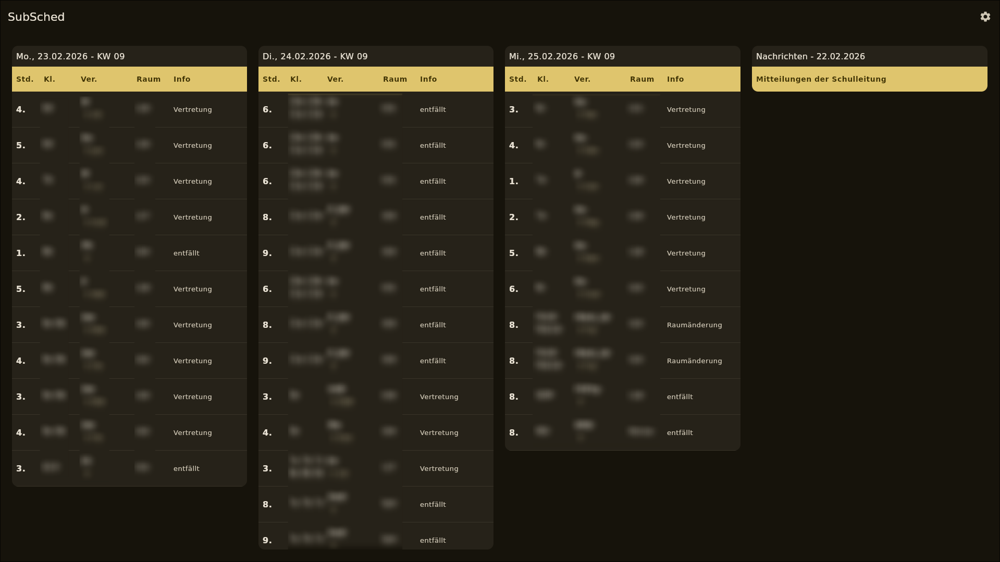
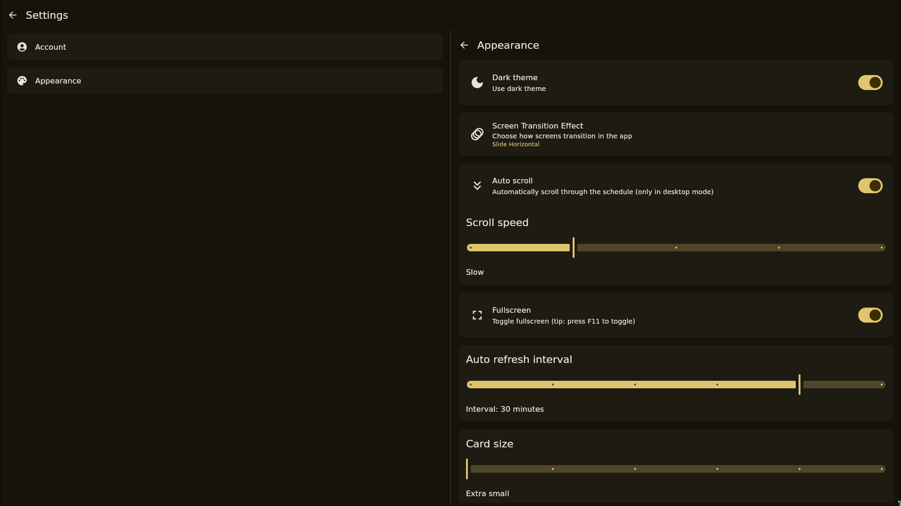
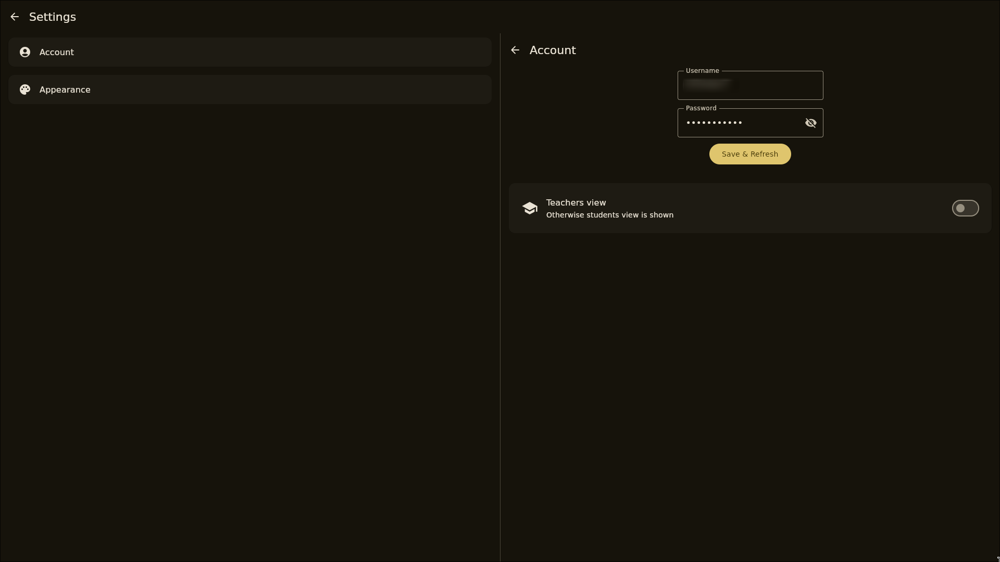
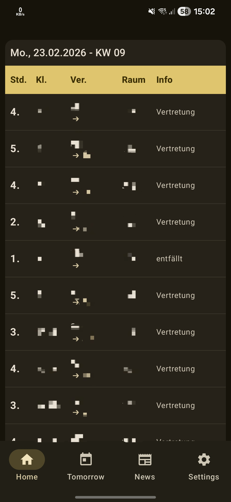
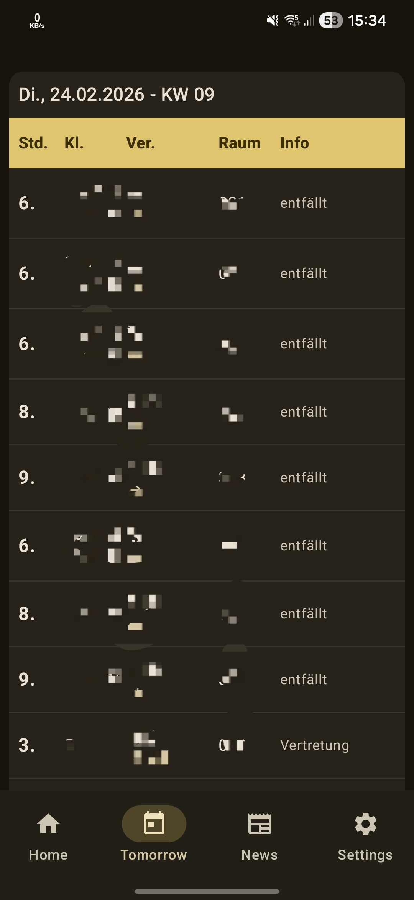
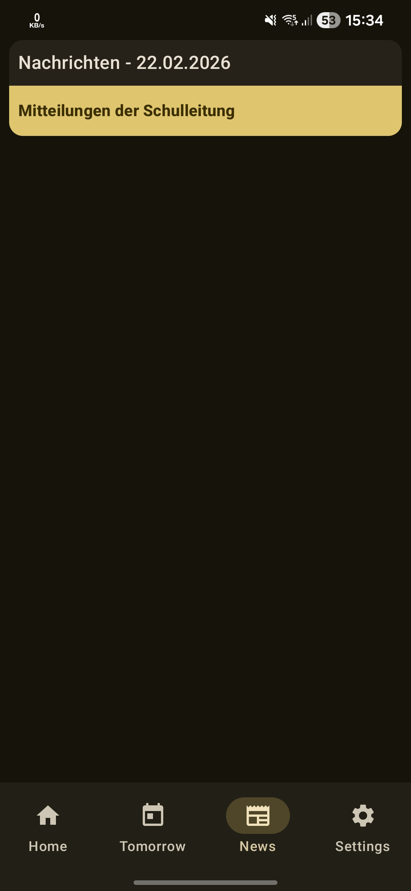

<div align="center">
  <a href="https://github.com/KyNarec/SubSched/releases"></a>
  <a href="https://github.com/KyNarec/SubSched/releases/latest"></a>
  <a href="https://github.com/KyNarec/SubSched/releases/latest"></a>

</div>

**SubSched** is a Compose Multiplatform app to fetch substitute schedules from [schule-infoportal.de/infoscreen](https://schule-infoportal.de/infoscreen)

---
## Previews

<div align="center">
     <br>
     <br>
     <br>
</div>

<div align="center">
     
    
    
</div>

--- 
## Installation
### Linux
#### Ubuntu/Debian/Mint
##### x86
```bash
sudo dpkg -i SubSched_1.1.0_amd64_custom.deb
```
##### ARM
```bash
sudo dpkg -i SubSched_1.1.0_arm64_custom.deb
```
Tip: use `curl -OL https://github.com/KyNarec/SubSched/releases/download/v1.1.0/SubSched_1.1.0_arm64_custom.deb`
to download the ARM version to your current directory
#### Arch
```bash
sudo pacman -U SubSched-1.1.0-1-x86_64.pkg.tar.zst 
```
### Android
Download and install SubSched_v1.1.0.apk from [latest GitHub release](https://github.com/KyNarec/SubSched/releases/latest)

### MacOS
Currently there is no official build for MacOS, but you can simply clone the project, run
```bash
./gradlew packageReleaseDistributionForCurrentOS
```
and you will get a .dmg file

### Windows
Download and install SubSched-1.1.0.msi from [latest GitHub releases](https://github.com/KyNarec/SubSched/releases/latest)

---


## Acknowledgments
- [SubstituteSchedule](https://github.com/KyNarec/SubstituteSchedule) A Compose Multiplatform App replacing the need for the "DSBmobile" app.
- [KSafe](https://github.com/ioannisa/KSafe) Enterprise-Grade Encrypted key-value storage for Kotlin Multiplatform and Native Android with Hardware-Backed Security.
- Learn more about [Kotlin Multiplatform](https://www.jetbrains.com/help/kotlin-multiplatform-dev/get-started.html)...
